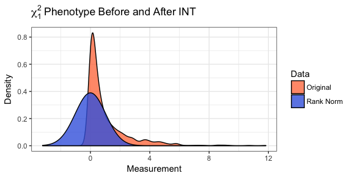
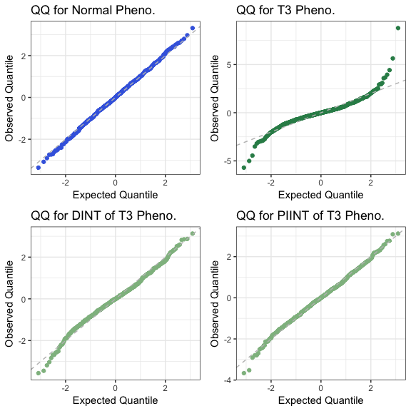
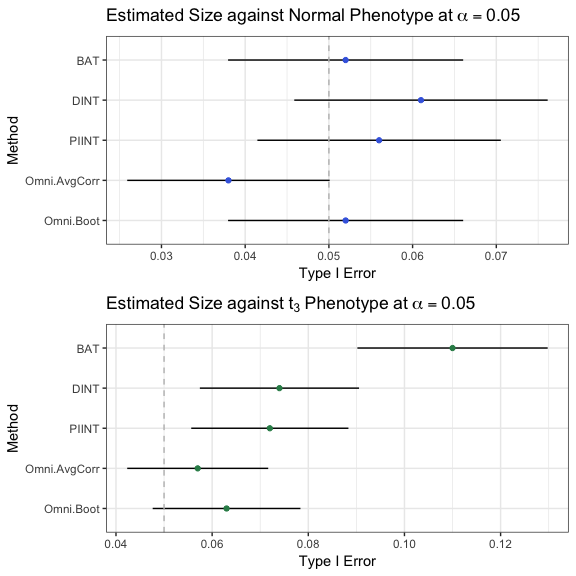

README
================
Zachary McCaw
02/19/2018

Purpose
=======

Genetic association tests for continuous phenotypes often assume normally distributed residuals. When the distribution of phenotypic residuals is skewed or heavy tailed, naive application of methods assuming normality can lead to an excess of false positive associations under the null, and loss of power under the alternative. Rank based inverse normal transformation (INT) has been applied in such cases to mitigate departures from normality. `RNOmni` provides an omnibus INT-based association test, synthesizing two approaches found to robustly control the type I error. In simulations, the omnibus test both provided valid inference, and achieved power comparable to the more powerful of the component methods.

Package Vignette
================

Contents
========

-   [Motivating Example](#motivating-example)
-   [Rank Normal Omnibus Test](#omnibus-association-test)
-   [Additional Association Tests](#additional-association-tests)
-   [Comparison of Association Tests](#comparison-of-association-tests)
-   [Additional Details](#additional-details)

Motivating Example
==================

Our motivation for investigating the rank based inverse normal transformation (INT) came from the study of obstructive sleep apnea (OSA). The gold standard measurement for diagnosing OSA is the apnea hypopnea index (AHI), a continuous, positively skewed trait with a distribution that resembles *χ*<sup>2</sup>. The residuals obtained by regressing AHI on genotype and covariates are often non-normal, and application of standard association tests leads to an excess of false positive associations, i.e. inflated type I error. To counteract departures from normality, INT transformation of AHI prior to genetic association testing has been proposed. As demonstrated in the following figure, INT of a continuous measurement causes the distribution of that measurement to appear normal within the sample.

``` r
# Chi-1 data
y = rchisq(n=1000,df=1);
# Rank-normalize
z = RNOmni::rankNormal(y);
```



Simulated Data
--------------

Within `RNOmni`, simulated data is available for 10<sup>3</sup> subjects. Covariates include `Age` and `Sex`. Structure adjustments include the first two principal components, `pc1` and `pc2`, of the centered and scaled subject by locus genotype matrix. Genotypes at 10<sup>3</sup> loci on chromosome one are also included. All loci are common, with sample minor allele frequency falling in the range \[0.05, 0.50\]. Two independent phenotypes were generated under the null hypothesis of no genotypic effect. `YN` has normally distributed residuals, while `YT3` has heavy tailed residuals from a *t*<sub>3</sub> distribution. The residual distributions were scaled to have unit variance.

``` r
## Example data
X = RNOmni::X;
cat("Covariates\n");
round(head(X),digits=2);
cat("\n");
cat("Structure Adjustments\n");
S = RNOmni::S;
round(head(S),digits=2);
cat("\n");
cat("Genotype Matrix\n");
G = RNOmni::G;
G[1:6,1:6];
cat("\n");
cat("Sample Minor Allele Frequency\n");
summary(apply(G,MARGIN=1,FUN=mean)/2);
cat("\n");
cat("Phenotypes\n");
Y = RNOmni::Y;
round(head(Y),digits=2);
```

    ## Covariates
    ##        Age Sex
    ## [1,] 48.33   0
    ## [2,] 45.02   1
    ## [3,] 52.74   1
    ## [4,] 50.27   0
    ## [5,] 50.91   1
    ## [6,] 48.08   1
    ## 
    ## Structure Adjustments
    ##        PC1   PC2
    ## [1,] -1.90 11.54
    ## [2,]  5.43 -1.75
    ## [3,] 16.76 -3.23
    ## [4,] 19.29 13.15
    ## [5,]  2.92  1.49
    ## [6,] 10.92 -7.55
    ## 
    ## Genotype Matrix
    ##    s1 s2 s3 s4 s5 s6
    ## g1  0  0  0  1  0  0
    ## g2  1  0  2  0  1  0
    ## g3  0  0  0  1  1  0
    ## g4  2  2  0  0  1  1
    ## g5  2  1  0  2  1  1
    ## g6  0  0  0  0  0  0
    ## 
    ## Sample Minor Allele Frequency
    ##    Min. 1st Qu.  Median    Mean 3rd Qu.    Max. 
    ## 0.05000 0.09388 0.14725 0.18591 0.24213 0.50000 
    ## 
    ## Phenotypes
    ##        YN  YT3
    ## [1,] 2.68 2.32
    ## [2,] 3.42 4.43
    ## [3,] 3.80 4.95
    ## [4,] 4.44 3.47
    ## [5,] 3.79 4.39
    ## [6,] 3.78 3.54

Normal QQ Plots for Phenotypic Residuals
----------------------------------------

The following quantile-quantile (QQ) plots demonstrate the effect of INT on model residuals. In blue are the residuals for standard linear regression of the normal phenotype on covariates *X* and structure adjustments *S*. In dark green are the residual for standard linear regression of the *t*<sub>3</sub> phenotype on *X* and *S*. The heavier tails of the *t*<sub>3</sub> distribution are evidenced by the departures of the observed quantiles from their expectations away from the origin.

In light green are the residuals from [direct INT](#direct-inverse-normal-transformation) (DINT) and [partially indirect INT](#partially-indirect-inverse-normal-transformation) (PIINT) of the *t*<sub>3</sub> phenotype. The validity of the INT-based association tests derives from the closer adherence of the observed quantiles to their expectations in these models. The omnibus test synthesizes the association statistics from the DINT and PIINT models.



Rank Normal Omnibus Test
------------------------

`RNOmni` implements an adaptive test of association between the loci in *G* and the phenotype *y*, while adjusting for covariates *X* and population structure *S*. Internally, `RNOmni` conducts two association tests, `DINT` and `PIINT`, described below, then calculates an omnibus statistic based on whichever approach provides more evidence against the null hypothesis. Synthesizing two complementary, INT-based approaches, affords the omnibus test robustness to the distribution of phenotypic residuals. In the absence of a genotypic effect, `RNOmni` routinely controls the type I error. In the presence of a genotypic effect, `RNOmni` performs comparably to the more powerful of `DINT` and `PIINT`.

Estimation of a *p*-value for the omnibus statistic requires an estimate of the correlation *ρ* between the test statistics provided by `DINT` and `PIINT`. When the sample size and number of loci are both relatively large, a computationally efficient estimate of *ρ* is obtained by averaging the product *z*<sub>DINT</sub> ⋅ *z*<sub>PIINT</sub> across loci. If either the sample size or the number of loci is relatively small, bootstrap can provide a locus-specific estimates of *ρ*. To accelerate the bootstrap, register a parallel backend, e.g. `doMC::registerDoMC(cores=2)`, then pass the `parallel=T` option to `RNOmni`. The user may also estimate *ρ* external to `RNOmni`, then manually specify the value of *ρ* for association testing.

The output of `RNOmni` is a numeric matrix of *p*-values, with rows corresponding to the rows of *G*. The columns are the *p*-values from the `DINT`, the `PIINT`, and the omnibus tests, respectively. Note that, without additional adjustment for multiple testing, taking the minimum *p*-value across each row would not result in a valid test of association.

``` r
cat("Omnibus Test, Normal Phenotype, Average Correaltion Method\n");
p1.omni.avg = RNOmni::RNOmni(y=Y[,1],G=G,X=X,S=S,method="AvgCorr");
round(head(p1.omni.avg),digits=3);
cat("\n");
cat("Omnibus Test, Normal Phenotype, Bootstrap Correaltion Method\n");
set.seed(100);
p1.omni.boot = RNOmni::RNOmni(y=Y[,1],G=G,X=X,S=S,method="Bootstrap",B=100);
round(head(p1.omni.boot),digits=3);
cat("\n");
cat("Omnibus Test, T3 Phenotype, Average Correaltion Method\n");
p2.omni.avg = RNOmni::RNOmni(y=Y[,2],G=G,X=X,S=S,method="AvgCorr");
round(head(p2.omni.avg),digits=3);
cat("\n");
cat("Omnibus Test, T3 Phenotype, Bootstrap Correaltion Method\n");
p2.omni.boot = RNOmni::RNOmni(y=Y[,2],G=G,X=X,S=S,method="Bootstrap",keep.rho=T,B=100);
round(head(p2.omni.boot),digits=3);
cat("\n");
cat("Replicate the Omnibus Test on the T3 Phenotype, Manually Specifying Correlation\n");
p2.omni.manual = RNOmni::RNOmni(y=Y[,2],G=G,X=X,S=S,method="Manual",set.rho=p2.omni.boot[,"Corr"],keep.rho=T);
round(head(p2.omni.manual),digits=3);
cat("\n");
```

    ## Omnibus Test, Normal Phenotype, Average Correaltion Method
    ##     DINT PIINT RNOmni
    ## g1 0.626 0.653  0.698
    ## g2 0.727 0.764  0.789
    ## g3 0.165 0.167  0.212
    ## g4 0.866 0.910  0.907
    ## g5 0.469 0.509  0.544
    ## g6 0.584 0.568  0.642
    ## 
    ## Omnibus Test, Normal Phenotype, Bootstrap Correaltion Method
    ##     DINT PIINT RNOmni
    ## g1 0.626 0.653  0.661
    ## g2 0.727 0.764  0.757
    ## g3 0.165 0.167  0.188
    ## g4 0.866 0.910  0.884
    ## g5 0.469 0.509  0.503
    ## g6 0.584 0.568  0.598
    ## 
    ## Omnibus Test, T3 Phenotype, Average Correaltion Method
    ##     DINT PIINT RNOmni
    ## g1 0.751 0.690  0.736
    ## g2 0.540 0.531  0.583
    ## g3 0.201 0.249  0.238
    ## g4 0.192 0.197  0.228
    ## g5 0.329 0.332  0.376
    ## g6 0.462 0.431  0.482
    ## 
    ## Omnibus Test, T3 Phenotype, Bootstrap Correaltion Method
    ##     DINT PIINT RNOmni  Corr
    ## g1 0.751 0.690  0.718 0.980
    ## g2 0.540 0.531  0.568 0.972
    ## g3 0.201 0.249  0.233 0.959
    ## g4 0.192 0.197  0.219 0.969
    ## g5 0.329 0.332  0.359 0.979
    ## g6 0.462 0.431  0.472 0.966
    ## 
    ## Replicate the Omnibus Test on the T3 Phenotype, Manually Specifying Correlation
    ##     DINT PIINT RNOmni  Corr
    ## g1 0.751 0.690  0.718 0.980
    ## g2 0.540 0.531  0.568 0.972
    ## g3 0.201 0.249  0.233 0.959
    ## g4 0.192 0.197  0.219 0.969
    ## g5 0.329 0.332  0.359 0.979
    ## g6 0.462 0.431  0.472 0.966

Since the phenotype was simulated under the null hypothesis of no genotypic effect, the expected false positive rate at *α* level 0.05 is 5%. For both the normal and heavy tailed *t*<sub>3</sub> phenotypes, the 95% confidence interval for the type I error includes the expected value of 0.05. As shown in the [comparison of association tests](#comparison-of-association-tests), naively applying the [basic association test](#basic-association-test) leads to an excess of false positive associations in the latter case.

    ## Type I Error of Rank Normal Omnibus Test:
    ##   Phenotype    Method  Size     L     U
    ## 1    Normal   AvgCorr 0.038 0.026 0.050
    ## 2    Normal Bootstrap 0.052 0.038 0.066
    ## 3        T3   AvgCorr 0.057 0.042 0.072
    ## 4        T3 Bootstrap 0.063 0.048 0.078

Additional Association Tests
============================

In addition to the omnibus test, three genetic association tests are implemented as part of `RNOmni`. These are the basic association test `BAT`, the direct INT method `DINT`, and the partially indirect INT method `PIINT`.

Basic Association Test
----------------------

`BAT` regresses the untransformed phenotype *y* on genotype at each locus in *G*, adjusting for covariates *X* and population structure *S*. A *p*-value assessing the null hypothesis of no genotypic effect is estimated using the Wald statistic. The output is a numeric vector, with one *p*-value per row of *G*.

``` r
# Basic Association Test
p1.bat = RNOmni::BAT(y=Y[,1],G=G,X=X,S=S);
round(head(p1.bat),digits=3);
```

    ##    g1    g2    g3    g4    g5    g6 
    ## 0.679 0.737 0.165 0.901 0.477 0.568

Direct Inverse Normal Transformation
------------------------------------

`DINT` regresses the transformed phenotype INT(*y*) on genotype at each locus in *G*, adjusting for covariates *X* and population structure *S*. A *p*-value assessing the null hypothesis of no genotypic effect is estimated via the Wald statistic. The output is a numeric vector, with one *p*-value per row of *G*.

``` r
# Direct INT Test
p1.dint = RNOmni::DINT(y=Y[,1],G=G,X=X,S=S);
round(head(p1.dint),digits=3);
```

    ##    g1    g2    g3    g4    g5    g6 
    ## 0.626 0.727 0.165 0.866 0.469 0.584

Partially Indirect Inverse Normal Transformation
------------------------------------------------

`PIINT` implements a two-stage association test. In the first stage, the untransformed phenotype *y* is regressed on covariates *X* to obtain residuals *e*. In the second stage, the transformed residuals INT(*e*) are regressed on genotype at each locus in *G*, adjusting for population structure *S*. A *p*-value assessing the null hypothesis of no genotypic effect is estimated via the Wald statistic. The output is a numeric vector, with one *p*-value per row of *G*.

``` r
# Partially Indirect INT Test
p1.piint = RNOmni::PIINT(y=Y[,1],G=G,X=X,S=S);
round(head(p1.piint),digits=3);
```

    ##    g1    g2    g3    g4    g5    g6 
    ## 0.653 0.764 0.167 0.910 0.509 0.568

In naming `PIINT`, "indirect" refers to the fact that residuals are formed prior to INT, rather than directly transforming the phenotype. "Partially" refers to the fact that residuals are formed w.r.t. covariates *X*, but not structure adjustments *S*. Performance of a fully indirect association test, in which *y* is regressed on both *X* and *S* during residual formation, was investigated. The fully indirect association test did not consistently provide valid inference.

Comparison of Association Tests
===============================

The following figure depicts the estimated type I error for association tests against the normal and *t*<sub>3</sub> phenotypes at *α* level 0.05. Point estimates are obtained by averaging an indicator of rejection, and the error bars provide 95% confidence intervals. Although all methods perform comparable against the normal phenotype, the false positive rate is inflated when the basic association approach is applied in the presence of heavy tailed *t*<sub>3</sub> residuals. This problem is exacerbated when considering increasingly small *α* levels.



Additional Notes
================

Definition of the Rank Based Inverse Normal Transformation
----------------------------------------------------------

Suppose a continuous measurement is available for each of *n* subjects. Let *u*<sub>*i*</sub> denote the measurement for the *i*th subject, and let rank(*u*<sub>*i*</sub>) denote the sample rank of *u*<sub>*i*</sub> when the measurements are placed in ascending order. The rank based inverse normal transformation is defined as:

$$
\\text{INT}(u\_{i}) = \\Phi^{-1}\\left\[\\frac{\\text{rank}(u\_{i})-k}{n-2k+1}\\right\] 
$$

Here *k* ∈ (0, 1/2) is an offset introduced to avoid mapping the sample maximum to infinity. By default, the Blom offset of *k* = 3/8 is adopted.

Run Time
--------

During package development, the `BAT`, `DINT`, and `PIINT` each took a median of between 19 to 21 ms to perform 10<sup>2</sup> association tests for 10<sup>3</sup> subjects. `RNOmni` using average correlation, which internally performs both `DINT` and `PIINT`, required a median of between 55 and 60 ms. Using bootstrap to calculate position specific correlations increased the run time of `RNOmni` by a factor of 9 to 10 while running 4 cores in parallel. Using `RNOmni` with the `parallel=T` option is advised if using the bootstrap approach.

Missingness
-----------

Observations are excluded from association testing if any of the phenotype *y*, the covariates *X*, or the structure adjustments *S* are missing. An observation missing genotype data *G* is excluded from association testing only at those loci were the genotype is missing.
