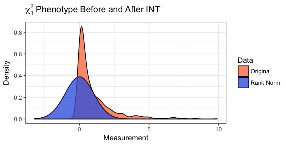
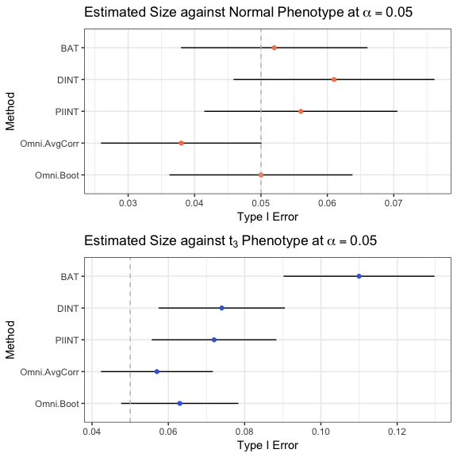

README
================
Zachary McCaw
10/26/2017

Purpose
=======

Genetic association tests for continuous phenotypes often assume normally distributed residuals. When the distribution of phenotypic residuals is skewed or heavy tailed, naive application of methods assuming normality can lead to an excess of false positive associations under the null, and loss of power under the alternative. Rank based inverse normal transformation (INT) has been applied in such cases to mitigate departures from normality. `RNOmni` provides an omnibus INT-based association test, synthesizing two approaches found to robustly control the type I error. In simulations, the omnibus test both provided valid inference, and achieved power comparable to the more powerful of the component methods.

Package Vignette
================

Contents
--------

-   [Motivating Example](#motivating-example)
-   [Rank Normal Omnibus Test](#omnibus-association-test)
-   [Additional Association Tests](#additional-association-tests)
-   [Comparison of Association Tests](#comparison-of-association-tests)
-   [Additional Details](#additional-details)

Motivating Example
------------------

Motivation for investigating the rank based inverse normal transformation (INT) came from the study of obstructive sleep apnea (OSA). The gold standard measurement for diagnosing OSA is the apnea hypopnea index (AHI), a continuous, positively skewed trait with a distribution that resembles *χ*<sup>2</sup>. The residuals obtained by regressing AHI on genotype and covariates are often non-normal, and application of standard association tests leads to an excess of false positive associations, i.e. inflated type I error. To counteract departures from normality, INT transformation of AHI prior to genetic association testing has been proposed. As demonstrated in the following figure, INT of a continuous measurement causes the distribution of that measurement in the sample to appear normal.

``` r
# Chi-1 data
y = rchisq(n=1000,df=1);
# Rank-normalize
z = RNOmni::rankNormal(y);
```



#### Simulated Data

Within `RNOmni`, simulated data is available for 10<sup>3</sup> subjects. Covariates include `Age` and `Sex`. Structure adjustments include the first two principal components, `pc1` and `pc2`, of the centered and scaled subject by locus genotype matrix. Genotypes at 10<sup>3</sup> loci on chromosome one are also included. All loci are common, with sample minor allele frequency falling in the range \[0.230, 0.403\]. Two independent phenotypes were generated under the null hypothesis of no genotypic effect. `YN` has normally distributed residuals, while $\`YT3$ has heavy tailed residuals from a *t*<sub>3</sub> distribution. The residual distributions were scaled to have unit variance.

``` r
library(RNOmni);
## Example data
X = RNOmni::X;
cat("Covariates\n");
round(head(X),digits=2);
cat("\n");
cat("Structure Adjustments\n");
S = RNOmni::S;
round(head(S),digits=2);
cat("\n");
cat("Genotype Matrix\n");
G = RNOmni::G;
G[1:6,1:6];
cat("\n");
cat("Sample Minor Allele Frequency\n");
summary(apply(G,MARGIN=2,FUN=mean)/2);
cat("\n");
cat("Phenotypes\n");
Y = RNOmni::Y;
round(head(Y),digits=2);
```

    ## Covariates
    ##          a s
    ## [1,] 48.33 0
    ## [2,] 45.02 1
    ## [3,] 52.74 1
    ## [4,] 50.27 0
    ## [5,] 50.91 1
    ## [6,] 48.08 1
    ## 
    ## Structure Adjustments
    ##        pc1   pc2
    ## [1,] -1.90 11.54
    ## [2,]  5.43 -1.75
    ## [3,] 16.76 -3.23
    ## [4,] 19.29 13.15
    ## [5,]  2.92  1.49
    ## [6,] 10.92 -7.55
    ## 
    ## Genotype Matrix
    ##      s1 s2 s3 s4 s5 s6
    ## [1,]  0  0  0  1  0  0
    ## [2,]  1  0  2  0  1  0
    ## [3,]  0  0  0  1  1  0
    ## [4,]  0  0  2  2  1  1
    ## [5,]  2  1  0  2  1  1
    ## [6,]  0  0  0  0  0  0
    ## 
    ## Sample Minor Allele Frequency
    ##    Min. 1st Qu.  Median    Mean 3rd Qu.    Max. 
    ##  0.2295  0.3050  0.3225  0.3217  0.3390  0.4030 
    ## 
    ## Phenotypes
    ##        YN  YT3
    ## [1,] 2.68 2.32
    ## [2,] 3.42 4.43
    ## [3,] 3.80 4.95
    ## [4,] 4.44 3.47
    ## [5,] 3.79 4.39
    ## [6,] 3.78 3.54

Rank Normal Omnibus Test
------------------------

`RNOmni` implements an adaptive test of association between the loci in *G* and the phenotype *y*, while adjusting for covariates *X* and population structure *S*. Internally, `RNOmni` conducts two association tests, `DINT` and `PIINT`, described below, then calculates an omnibus statistic based on whichever approach provides more evidence against the null hypothesis. Synthesizing two complementary, INT-based approaches, affords the omnibus test robustness to the distribution of phenotypic residuals. In the absence of a genotypic effect, `RNOmni` routinely controls the type I error. In the presence of a genotypic effect, `RNOmni` provides power comparable to the better of `DINT` and `PIINT`.

Estimation of a *p*-value for the omnibus statistic requires an estimate of the correlation *ρ* between the test statistics provided by `DINT` and `PIINT`. When the sample size and number of loci are both relatively large, a computationally efficient estimate of *ρ* is obtained by averaging across loci. If either the sample size or the number of loci is relatively small, bootstrap can provide a locus-specific estimates of *ρ*.

The output of `RNOmni` is a numeric matrix of *p*-values, with rows corresponding to the rows of *G*. The columns are the *p*-values from the `DINT`, the `PIINT`, and the omnibus tests, respectively. Note that, without additional adjustment for multiple testing, taking the minimum *p*-value across each row would not result in a valid test of association.

``` r
cat("Omnibus Test, Normal Phenotype, Average Correaltion Method\n");
p1.omni.avg = RNOmni::RNOmni(y=Y[,1],G=G,X=X,S=S,method="AvgCorr");
round(head(p1.omni.avg),digits=3);
cat("\n");
cat("Omnibus Test, Normal Phenotype, Bootstrap Correaltion Method\n");
set.seed(100);
p1.omni.boot = RNOmni::RNOmni(y=Y[,1],G=G,X=X,S=S,method="Bootstrap",B=100,cores=12);
round(head(p1.omni.boot),digits=3);
cat("\n");
cat("Omnibus Test, T3 Phenotype, Average Correaltion Method\n");
p2.omni.avg = RNOmni::RNOmni(y=Y[,2],G=G,X=X,S=S,method="AvgCorr");
round(head(p2.omni.avg),digits=3);
cat("\n");
cat("Omnibus Test, T3 Phenotype, Bootstrap Correaltion Method\n");
p2.omni.boot = RNOmni::RNOmni(y=Y[,2],G=G,X=X,S=S,method="Bootstrap",B=100,cores=12);
round(head(p2.omni.boot),digits=3);
cat("\n");
```

    ## Omnibus Test, Normal Phenotype, Average Correaltion Method
    ##       DINT PIINT RNOmni
    ## [1,] 0.626 0.653  0.698
    ## [2,] 0.727 0.764  0.789
    ## [3,] 0.165 0.167  0.212
    ## [4,] 0.866 0.910  0.907
    ## [5,] 0.469 0.509  0.544
    ## [6,] 0.584 0.568  0.642
    ## 
    ## Omnibus Test, Normal Phenotype, Bootstrap Correaltion Method
    ##       DINT PIINT RNOmni
    ## [1,] 0.626 0.653  0.654
    ## [2,] 0.727 0.764  0.749
    ## [3,] 0.165 0.167  0.187
    ## [4,] 0.866 0.910  0.886
    ## [5,] 0.469 0.509  0.504
    ## [6,] 0.584 0.568  0.606
    ## 
    ## Omnibus Test, T3 Phenotype, Average Correaltion Method
    ##       DINT PIINT RNOmni
    ## [1,] 0.751 0.690  0.736
    ## [2,] 0.540 0.531  0.583
    ## [3,] 0.201 0.249  0.238
    ## [4,] 0.192 0.197  0.228
    ## [5,] 0.329 0.332  0.376
    ## [6,] 0.462 0.431  0.482
    ## 
    ## Omnibus Test, T3 Phenotype, Bootstrap Correaltion Method
    ##       DINT PIINT RNOmni
    ## [1,] 0.751 0.690  0.725
    ## [2,] 0.540 0.531  0.569
    ## [3,] 0.201 0.249  0.233
    ## [4,] 0.192 0.197  0.220
    ## [5,] 0.329 0.332  0.372
    ## [6,] 0.462 0.431  0.471

Since the phenotype was simulated under the null hypothesis of no genotypic effect, the expected false positive rate at *α* level 0.05 is 5%. For both the normal and heavy tailed *t*<sub>3</sub> phenotypes, the 95% confidence interval for the type I error includes the expected value of 0.05. As shown in the [comparison of association tests](#comparison-of-association-tests), naively applying the [basic association test](#basic-association-test) leads to an excess of false positive associations in the latter case.

    ## Type I Error of Rank Normal Omnibus Test:
    ##   Phenotype    Method  Size     L     U
    ## 1    Normal   AvgCorr 0.038 0.026 0.050
    ## 2    Normal Bootstrap 0.050 0.036 0.064
    ## 3        T3   AvgCorr 0.057 0.042 0.072
    ## 4        T3 Bootstrap 0.064 0.049 0.079

Additional Association Tests
----------------------------

In addition to the omnibus test, three genetic association tests are implemented as part of `RNOmni`. These are the basic association test `BAT`, the direct INT method `DINT`, and the partially indirect INT method `PIINT`.

#### Basic Association Test

`BAT` regresses the untransformed phenotype *y* on genotype at each locus in *G*, adjusting for covariates *X* and population structure *S*. A *p*-value assessing the null hypothesis of no genotypic effect is estimated using the Wald statistic. The output is a numeric vector, with one *p*-value per row of *G*.

``` r
# Basic Association Test
p1.bat = RNOmni::BAT(y=Y[,1],G=G,X=X,S=S);
round(head(p1.bat),digits=3);
```

    ## [1] 0.679 0.737 0.165 0.901 0.477 0.568

#### Direct Inverse Normal Transformation

`DINT` regresses the transformed phenotype INT(*y*) on genotype at each locus in *G*, adjusting for covariates *X* and population structure *S*. A *p*-value assessing the null hypothesis of no genotypic effect is estimated via the Wald statistic. The output is a numeric vector, with one *p*-value per row of *G*.

``` r
# Direct INT Test
p1.dint = RNOmni::DINT(y=Y[,1],G=G,X=X,S=S);
round(head(p1.dint),digits=3);
```

    ## [1] 0.626 0.727 0.165 0.866 0.469 0.584

#### Partially Indirect Inverse Normal Transformation

`PIINT` implements a two-stage association test. In the first stage, the untransformed phenotype *y* is regressed on covariates *X* to obtain residuals *e*. In the second stage, the transformed residuals INT(*e*) are regressed on genotype at each locus in *G*, adjusting for population structure *S*. A *p*-value assessing the null hypothesis of no genotypic effect is estimated via the Wald statistic. The output is a numeric vector, with one *p*-value per row of *G*.

``` r
# Partially Indirect INT Test
p1.piint = RNOmni::PIINT(y=Y[,1],G=G,X=X,S=S);
round(head(p1.piint),digits=3);
```

    ## [1] 0.653 0.764 0.167 0.910 0.509 0.568

In naming `PIINT`, "indirect" refers to the fact that residuals are formed prior to INT, rather than directly transforming the phenotype. "Partially" refers to the fact that residuals are formed w.r.t. covariates *X*, but not structure adjustments *S*. Performance of a fully indirect association test, in which *y* is regressed on both *X* and *S* during residual formation, was investigated. The fully indirect association test did not consistently provide valid inference.

Comparison of Association Tests
-------------------------------

The following figure depicts the estimated type I error for association tests against the normal and *t*<sub>3</sub> phenotypes at *α* level 0.05. Point estimates are obtained by averaging an indicator of rejection, and the error bars provide 95% confidence intervals. Although all methods perform comparable against the normal phenotype, the false positive rate is inflated when the basic association approach is applied in the presence of heavy tailed *t*<sub>3</sub> residuals. This problem is exacerbated when considering increasingly small *α* levels.



Additional Details
------------------

#### Run time

During package development, the `BAT`, `DINT`, and `PIINT` each took a median of 25 to 30 ms to perform 10<sup>2</sup> association tests for 10<sup>3</sup> subjects. `RNOmni` using average correlation, which internally performs both `DINT` and `PIINT`, required a median of 65 to 70 ms. Using bootstrap to calculate position specific correlations increased the run time of `RNOmni` by a factor of 9 to 10.

``` r
# Subset to 100 loci
H = G[1:100,];
# Time performance
microbenchmark::microbenchmark(BAT(y=Y[,1],G=H,X=X,S=S),DINT(y=Y[,1],G=H,X=X,S=S),PIINT(y=Y[,1],G=H,X=X,S=S),
                               RNOmni(y=Y[,1],G=H,X=X,S=S,method="AvgCorr"),
                               RNOmni(y=Y[,1],G=H,X=X,S=S,method="Bootstrap",B=100,cores=12));
```

    ## Unit: milliseconds
    ##                                                                                     expr
    ##                                                     BAT(y = Y[, 1], G = H, X = X, S = S)
    ##                                                    DINT(y = Y[, 1], G = H, X = X, S = S)
    ##                                                   PIINT(y = Y[, 1], G = H, X = X, S = S)
    ##                              RNOmni(y = Y[, 1], G = H, X = X, S = S, method = "AvgCorr")
    ##  RNOmni(y = Y[, 1], G = H, X = X, S = S, method = "Bootstrap",      B = 100, cores = 12)
    ##        min         lq       mean     median         uq       max neval
    ##   20.66147   24.33218   33.30912   26.63031   29.83991  182.7083   100
    ##   20.81972   24.43546   28.49130   25.99496   28.99056  173.1551   100
    ##   18.15486   20.10238   27.64939   22.12817   24.80397  202.9361   100
    ##   53.16711   58.76989   75.93382   61.62635   67.62411  222.1083   100
    ##  995.92858 1055.87310 1297.53403 1128.01148 1646.59307 2153.7069   100

#### Missingness

Observations missing either the phenotype *y* or the the structure adjustments *S* are excluded. Missing covariates *X* are imputed to the median of the observed values. An observation missing genotype information *G* is excluded from association testing only at those loci were genotype is unobserved.

``` r
# Introduce Missingness
y.m = Y[,1];
y.m[sample(length(y.m),size=10,replace=F)] = NA;
G.m = G;
G.m[sample(length(G.m),size=10000,replace=F)] = NA;
X.m = X;
X.m[sample(length(X.m),size=100,replace=F)] = NA;
S.m = S;
S.m[sample(length(S.m),size=10,replace=F)] = NA;
# Association Testing after Missingness
pm.bat = RNOmni::BAT(y=y.m,G=G.m,X=X.m,S=S.m);
pm.dint = RNOmni::DINT(y=y.m,G=G.m,X=X.m,S=S.m);
pm.piint = RNOmni::PIINT(y=y.m,G=G.m,X=X.m,S=S.m);
pm.omni.avg = RNOmni::RNOmni(y=y.m,G=G.m,X=X.m,S=S.m);
pm.omni.boot = RNOmni::RNOmni(y=y.m,G=G.m,X=X.m,S=S.m,method="Bootstrap",B=100);
```

Below, size estimates for the normal phenotype in the absence and presence of missingness are tabulated:

    ## Normal Phenotype in the Absence of Missingness, Combined Results
    ##         Method  Size     L     U
    ## 1          BAT 0.052 0.038 0.066
    ## 2         DINT 0.061 0.046 0.076
    ## 3        PIINT 0.056 0.041 0.071
    ## 4 Omni.AvgCorr 0.038 0.026 0.050
    ## 5    Omni.Boot 0.050 0.036 0.064
    ## 
    ## Normal Phenotype in the Presence of Missingness, Combined Results
    ##      Method  Size     L     U
    ## 1       BAT 0.036 0.024 0.048
    ## 2      DINT 0.045 0.032 0.058
    ## 3     PIINT 0.039 0.027 0.051
    ## 4  Omni.Avg 0.023 0.014 0.032
    ## 5 Omni.Boot 0.035 0.023 0.047
