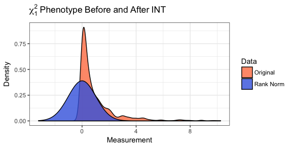

README
================
Zachary McCaw
04/17/2018

Purpose
=======

Genetic association tests for continuous phenotypes often assume normally distributed residuals. Departures from the assumed residual distribution can lead to an excess of false positive associations in the absence of genetic effects, and loss of power in the presence of genetic effects. When the outcome distribution is far from normal, the rank based inverse normal transformation (INT) has been applied to improve residual normality. `RNOmni` provides an omnibus, INT-based association test, synthesizing two approaches found to robustly control the type I error. In simulations, the omnibus test provided valid inference in the absence of a genotypic effect, while provided power comparable to the more efficient of the component methods in the presence of a genotypic effect.

Package Vignette
================

Contents
========

-   [Motivating Example](#motivating-example)
-   [Data](#data)
-   [Omnibus Test](#omnibus-test)
-   [Additional Association Tests](#additional-association-tests)
-   [Implementation Notes](#implementation-notes)

Motivating Example
==================

We consider the setting of genetic association testing with a continuous outcome whose residual distribution is skewed or heavy tailed as compared with the normal distribution. An example is provided by the apnea-hyopnea index (AHI), the gold standard measurement for diagnosing obstructive sleep apnea. The residual distribution obtained after regressing AHI on genotype and covariates is often non-normal. Application of standard association tests, even those which only rely on asymptotic normality, can lead to an excess of false positive associations when the departure from normality is severe.

The rank based inverse normal transformation (INT) has been proposed to counteract departures from normality. To apply INT, the sample measurements are ranked, and the observed order statistics are replaced with the corresponding quantiles of the standard normal distribution. Below, a sample of size *n* = 1000 is drawn from the *χ*<sub>1</sub><sup>2</sup> distribution. Provided the measurement is continuous, i.e. there are no ties, the distribution of the measurement in the sample is normal after INT.

``` r
# Chi-1 data
y = rchisq(n=1000,df=1);
# Rank-normalize
z = RNOmni::rankNormal(y);
```



Data
====

Simulated Data
--------------

Simulated data are available for 10<sup>3</sup> subjects. Covariates `X` include `Age` and `Sex`. Structure adjustments `S` include the first two principal components of the genetic relatedness matrix. Genotypes `G` at 10<sup>3</sup> contiguous loci on chromosome one were simulated using Hapgen2. All loci are common, with sample minor allele frequency in the range \[0.05, 0.50\]. Two independent phenotypes `Y` were generated under the null hypothesis of no genotypic effect. Subject specific means were calculated using a the covariates and structure adjustments. The outcome was formed by adding a random residual to the mean. `YN` has normally distributed residuals, while `YT3` has residuals drawn from a heavy tailed *t*<sub>3</sub> distribution. The residual distributions were scaled to have unit variance.

    ## Covariates
    ##        Age Sex
    ## [1,] 47.32   1
    ## [2,] 53.14   1
    ## [3,] 48.85   0
    ## [4,] 52.38   0
    ## [5,] 50.96   0
    ## [6,] 52.23   0
    ## 
    ## Structure Adjustments
    ##        pc1   pc2
    ## [1,]  1.21  0.62
    ## [2,]  1.67  2.18
    ## [3,]  0.35  0.98
    ## [4,] -1.13  0.34
    ## [5,]  2.27 -0.30
    ## [6,] -0.03  0.94
    ## 
    ## Genotype Matrix
    ##    G1 G2 G3 G4 G5 G6
    ## N1  2  0  0  0  0  0
    ## N2  0  1  1  0  0  0
    ## N3  1  1  0  0  0  0
    ## N4  0  1  0  0  0  1
    ## N5  0  1  0  0  0  1
    ## N6  1  1  0  0  0  0
    ## 
    ## Sample Minor Allele Frequency
    ##    Min. 1st Qu.  Median    Mean 3rd Qu.    Max. 
    ##  0.0500  0.0935  0.1730  0.2011  0.3129  0.4995 
    ## 
    ## Phenotypes
    ##         YN   YT3
    ## [1,] -1.81 -0.06
    ## [2,]  1.60  1.44
    ## [3,] -0.21 -0.24
    ## [4,] -2.41 -0.94
    ## [5,]  0.08  1.19
    ## [6,]  0.43 -0.03

Data Formatting
---------------

All matrices, including genotypes `G`, covariates `X`, and structure adjustments `S`, are expected in numeric format. Factors and interactions should be expanded in advance, e.g. using `model.matrix`. If an intercept is required, include a vector of constants in `X`. All matrices are formatted with subjects as rows.

Omnibus Test
============

`RNOmni` implements an adaptive test of association between the loci in *G* and the phenotype *y*, while adjusting for covariates *X* and population structure *S*. Internally, `RNOmni` conducts two association tests, termed direct INT `DINT` and indirect INT `IINT`. These tests are described [below](#additional-association-tests). On omnibus statistic is calculated based on whichever approach provides more evidence against the null hypothesis. Synthesizing two complementary approaches affords the omnibus test robustness to the distribution of phenotypic residuals. In simulations against various skewed and heavy tailed residual distributions, the omnibus test provided valid inference in the absence of a genotypic effect, and provided power comparable to the more powerful of the component methods in the presence of a genotypic effect.

Assigning a *p*-value to the omnibus statistic requires an estimate of the correlation *ρ* between the test statistics provided by `DINT` and `IINT`. When many loci are under consideration, a computationally efficient strategy is to estimate *ρ* by taking the correlation between the observed test statistics across loci. Alternatively, when there are fewer loci, or locus specific estimates are desired, *ρ* may be estimated using bootstrap. In simulations, the value of *ρ* estimated by taking the correlation across loci agreed with the average of the locus specific estimates of *ρ* obtained using bootstrap. Finally, the user may estimate the correlation externally, then manually specify the value of *ρ*.

By default, the output of `RNOmni` is a numeric matrix of *p*-values, with rows corresponding to the loci of *G*. The columns are the *p*-values from the `DINT`, the `IINT`, and the omnibus tests, respectively. If `keep.stats=T`, the test statistics are retained. If `keep.rho=T`, the estimated correlation between the *p*-values provided by `DINT` and `IINT` is retained.

``` r
cat("Omnibus Test, Normal Phenotype, Average Correaltion Method\n");
p1.omni.avg = RNOmni::RNOmni(y=Y[,1],G=G,X=X,S=S,method="AvgCorr");
round(head(p1.omni.avg),digits=3);
cat("\n");
cat("Omnibus Test, Normal Phenotype, Bootstrap Correaltion Method\n");
set.seed(100);
p1.omni.boot = RNOmni::RNOmni(y=Y[,1],G=G,X=X,S=S,method="Bootstrap",B=100);
round(head(p1.omni.boot),digits=3);
cat("\n");
cat("Omnibus Test, T3 Phenotype, Average Correaltion Method\n");
p2.omni.avg = RNOmni::RNOmni(y=Y[,2],G=G,X=X,S=S,method="AvgCorr");
round(head(p2.omni.avg),digits=3);
cat("\n");
cat("Omnibus Test, T3 Phenotype, Bootstrap Correaltion Method\n");
p2.omni.boot = RNOmni::RNOmni(y=Y[,2],G=G,X=X,S=S,method="Bootstrap",keep.rho=T,B=100);
round(head(p2.omni.boot),digits=3);
cat("\n");
cat("Replicate the Omnibus Test on the T3 Phenotype, Manually Specifying Correlation\n");
p2.omni.manual = RNOmni::RNOmni(y=Y[,2],G=G,X=X,S=S,method="Manual",set.rho=p2.omni.boot[,"Corr"],keep.rho=T);
round(head(p2.omni.manual),digits=3);
cat("\n");
```

Additional Association Tests
============================

In addition to the omnibus test, three genetic association tests are implemented as part of `RNOmni`. These are the basic association test `BAT`, the direct INT method `DINT`, and the indirect INT method `IINT`.

Basic Association Test
----------------------

`BAT` regresses the untransformed phenotype *y* on genotype at each locus in *G*, adjusting for covariates *X* and population structure *S*. A *p*-value assessing the null hypothesis of no genotypic effect is estimated using a score test. The output is a numeric matrix, including the score statistic and *p*-value for each locus in `G`.

``` r
# Basic Association Test
p.bat = RNOmni::BAT(y=Y[,1],G=G,X=X,S=S);
round(head(p.bat),digits=3);
```

    ##    Score     P
    ## G1 0.691 0.406
    ## G2 1.714 0.191
    ## G3 1.151 0.284
    ## G4 0.945 0.331
    ## G5 0.321 0.571
    ## G6 4.264 0.039

Direct Inverse Normal Transformation
------------------------------------

`DINT` regresses the transformed phenotype INT(*y*) on genotype at each locus in *G*, adjusting for covariates *X* and population structure *S*. A *p*-value assessing the null hypothesis of no genotypic effect is estimated using a score test. The output is a numeric matrix, including the score statistic and *p*-value for each locus in `G`.

``` r
# Direct INT Test
p.dint = RNOmni::DINT(y=Y[,1],G=G,X=X,S=S);
round(head(p.dint),digits=3);
```

    ##    Score     P
    ## G1 0.755 0.385
    ## G2 1.728 0.189
    ## G3 1.113 0.292
    ## G4 1.017 0.313
    ## G5 0.247 0.619
    ## G6 4.231 0.040

Indirect Inverse Normal Transformation
--------------------------------------

`IINT` implements a two-stage association test. In the first stage, the untransformed phenotype *y* is regressed on covariates *X* and population structure *S* to obtain residuals *e*. Likewise, genotype *g* at the locus under scrutiny is regressed on covariates *X* and population structure *S* to obtain residuals *h*. In the second stage, the transformed phenotypic residuals INT(*e*) are regressed on genotypic residuals *h*. The output is a numeric matrix, including the Wald statistic and *p*-value for each locus in `G`.

``` r
# Partially Indirect INT Test
p.iint = RNOmni::IINT(y=Y[,1],G=G,X=X,S=S);
round(head(p.iint),digits=3);
```

    ##     Wald     P
    ## G1 0.691 0.406
    ## G2 1.695 0.193
    ## G3 1.171 0.279
    ## G4 1.052 0.305
    ## G5 0.284 0.594
    ## G6 4.247 0.039

Implementation Notes
====================

Definition of the Rank Based Inverse Normal Transformation
----------------------------------------------------------

Suppose that a continuous measurement *u*<sub>*i*</sub> is observed for each of *n* subjects. Let rank(*u*<sub>*i*</sub>) denote the sample rank of *u*<sub>*i*</sub> when the measurements are placed in ascending order. The rank based inverse normal transformation is defined as:

$$
\\text{INT}(u\_{i}) = \\Phi^{-1}\\left\[\\frac{\\text{rank}(u\_{i})-k}{n-2k+1}\\right\] 
$$

Here *k* ∈ (0, 1/2) is an adjustable offset. By default, the Blom offset of *k* = 3/8 is adopted.

Missingness
-----------

Observations are excluded from all association tests if any of the phenotype *y*, the covariates *X*, or the structure adjustments *S* are missing. An observation missing genotype data *G* is excluded only from association testing at those loci were the genotype is missing.

Nomenclature
------------

In `DINT`, direct refers to the fact that INT is applied *directly* to the phenotype `y`. In contrast, during `IINT`, the INT is applied to the phenotype only *indirectly*, i.e. to the phenotypic residuals.

Parallelization
---------------

All association tests have the option of being run in parallel. To do so, register a parallel backend, e.g. `doMC::registerDoMC(cores=4)`, then specify the `parallel=T` option.
