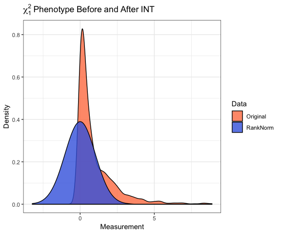
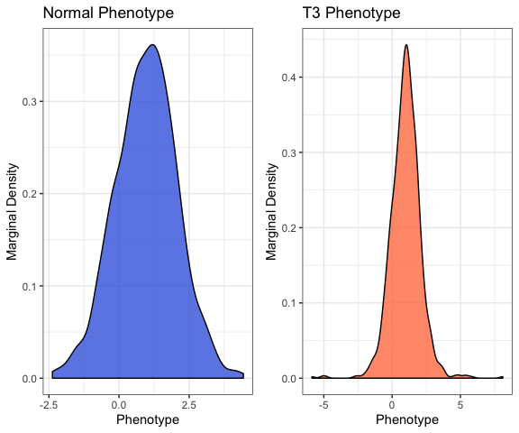

---
title: "README"
author: "Zachary McCaw"
date: "2019-01-12"
output: 
  html_document: 
    keep_md: TRUE
--- 

# Purpose

Implementation of genetic association tests that incorporate the rank-based inverse normal transformation (INT). These tests are broadly indicated for traits with continuous residual distributions. In the presence of non-normal residuals, INT-based tests robustly control the type I error, whereas standard linear regression may not. Moreover, INT-based tests dominate standard linear regression in terms of power. There are two main strategies for incorporating the INT in association testing. In direct INT (D-INT), the trait is directly transformed. In indirect INT (I-INT), residuals are formed by regressing the trait on covariates prior to transformation. Neither D-INT nor I-INT is uniformly most powerful. The INT omnibus test (O-INT) adaptively combines D-INT and I-INT into a single robust and statistically powerful test. 

# Package Vignette


# Contents

* [Setting](#setting)
* [Data](#data)
* [Basic Association Test](#basic-association-test)
* [Inverse Normal Transformation](#inverse-normal-transformation)
* [Direct INT](#direct-inverse-normal-transformation)
* [Indirect INT](#indirect-inverse-normal-transformation)
* [Omnibus INT](#omnibus-test)
* [Notes](#notes)

# Setting

Consider genetic association analysis with a continuous trait. If the residual distribution is skewed or kurtotic (prone to outliers), standard linear regression may fail to control the type I error in moderate sample. Even if the sample is sufficiently large for standard linear regression to provide valid inference, it is not fully efficient when the residual distribution is non-normal. Examples of traits that may exhibit non-normal residual distributions include body mass index, circulating metabolites, gene expression, polysomnography signals, and spirometry measurements. In such cases, the rank based inverse normal transformation (INT) has been used to counteract departures from normality. During INT, the sample measurements are first mapped to the probability scale, by replacing the observed values with fractional ranks, then transformed into Z-scores using the probit function. In the following example, a sample of size $n=1000$ is drawn from the $\chi_{1}^{2}$ distribution. After transformation, the empirical distribution of the measurements in is indistinguishable from standard normal. 


```r
library(RNOmni);
# Sample from the chi-1 square distribution
y = rchisq(n=1000,df=1);
# Rank-normalize
z = rankNorm(y);
```


# Data
## Simulated Data
Here, simulated data are generated for $n=10^{3}$ subjects. Genotypes are drawn for $10^{3}$ loci in linkage equilibrium with minor allele frequency $0.25$. The model matrix `X` contains an intercept, four standard normal covariates `Z`, and the first four genetic principal components. The intercept is set to one, and the remaining regression coefficients are simulated as random effects. The proportion of phenotypic variation explained by covariates is 20%, while the proportion of variation explained by principal components is 5%. Two phenotypes with additive residuals are simulated. The first `yn` has standard normal residuals, while the second `yt` has $t_{3}$ residuals, scaled to have unit variance. 


```r
set.seed(100);
# Sample size
n = 1e3;
## Simulate genotypes
G = replicate(rbinom(n,size=2,prob=0.25),n=1e3);
storage.mode(G) = "numeric";
# Genetic principal components
S = svd(scale(G))$u[,1:4];
S = scale(S);
# Covariates
Z = scale(matrix(rnorm(n*4),nrow=n));
# Overall design
X = cbind(1,Z,S);
# Coefficient
b = c(1,rnorm(n=4,sd=1/sqrt(15)),rnorm(n=4,sd=1/sqrt(60)));
# Linear predictor
h = as.numeric(X%*%b);
# Normal phenotype
yn = h+rnorm(n);
# T-3 phenotype
yt = h+rt(n,df=3)/sqrt(3);
```


## Data Formatting
The outcome `y` is expected as a numeric vector. Genotypes `G` are expected as a numeric matrix, with subjects are rows. If adjusting for covariates or population structure, `X` is expected as a numeric matrix, which should contain an intercept. Factors and interactions should be expanded in advance, e.g. using `model.matrix`. Missingness is not expected in either the outcome vector `y` or the model matrix `X`, however the genotype matrix `G` may contain missingness. Observations with missing genotypes are excluded from association testing only at those loci where the genotype is missing. 

# Basic Association Test
The basic association test is linear regression of the (untransformed) phenotype on genotype and covariates. `BAT` provides an efficient implementation using phenotype `y`, genotypes `G`, and model matrix `X`. Standard output includes the score statistic, its standard error, the Z-score, and a $p$-value, with one row per column of `G`. Setting `test="Wald"` specifies a Wald test. The Wald test may provide more power, but is generally slower. Setting `simple=T` returns the $p$-values only. 

```r
# Basic Association Test, Normal Phenotype
Results_BAT_Yn = BAT(y=yn,G=G,X=X);
round(head(Results_BAT_Yn),digits=3);
# Basic Association Test, T3 Phenotype
Results_BAT_Yt  = BAT(y=yt,G=G,X=X);
round(head(Results_BAT_Yt),digits=3);
```

```
##     Score     SE      Z     p
## 1 -14.347 20.018 -0.717 0.474
## 2 -14.353 20.378 -0.704 0.481
## 3   7.091 18.754  0.378 0.705
## 4 -18.296 19.967 -0.916 0.360
## 5 -37.118 19.438 -1.910 0.056
## 6   4.238 20.000  0.212 0.832
##     Score     SE      Z     p
## 1   6.432 20.820  0.309 0.757
## 2  14.949 21.194  0.705 0.481
## 3  12.752 19.505  0.654 0.513
## 4  -6.692 20.767 -0.322 0.747
## 5 -29.284 20.217 -1.449 0.148
## 6  28.307 20.801  1.361 0.174
```

# Inverse Normal Transformation
Suppose that a continuous measurement $u_{i}$ is observed for each of $n$ subjects. Let $\text{rank}(u_{i})$ denote the sample rank of $u_{i}$ when the measurements are placed in ascending order. The rank based inverse normal transformation (INT) is defined as:

$$
\text{INT}(u_{i}) = \Phi^{-1}\left[\frac{\text{rank}(u_{i})-k}{n-2k+1}\right] 
$$

Here $\Phi^{-1}$ is the probit function, and $k\in(0,1/2)$ is an adjustable offset. By default, the Blom offset of $k=3/8$ is adopted.

# Direct INT
In direct INT (D-INT), the INT-transformed phenotype is regressed on genotype and covariates. D-INT is most powerful when the phenotype could have arisen from a rank-preserving transformation of a latent normal trait. `DINT` implements the association test using phenotype `y`, genotypes `G`, and model matrix `X`. Standard output includes the test statistic, its standard error, the Z-score, and a $p$-value, with one row per column of `G`. Wald and score tests are available. Setting `simple=T` returns the $p$-values only. 


```r
# Direct INT Test, Normal Phenotype
Results_DINT_Yn = DINT(y=yn,G=G,X=X);
round(head(Results_DINT_Yn),digits=3);
# Direct INT Test, T3 Phenotype
Results_DINT_Yt = DINT(y=yt,G=G,X=X);
round(head(Results_DINT_Yt),digits=3);
```

```
##     Score     SE      Z     p
## 1 -15.344 21.292 -0.721 0.471
## 2 -16.239 21.675 -0.749 0.454
## 3   7.155 19.948  0.359 0.720
## 4 -20.192 21.238 -0.951 0.342
## 5 -39.500 20.675 -1.911 0.056
## 6   3.006 21.273  0.141 0.888
##     Score     SE      Z     p
## 1   8.408 22.459  0.374 0.708
## 2  24.181 22.863  1.058 0.290
## 3  17.705 21.041  0.841 0.400
## 4 -12.449 22.402 -0.556 0.579
## 5 -31.537 21.808 -1.446 0.148
## 6  18.980 22.439  0.846 0.398
```

# Indirect INT
In indirect INT (I-INT), the phenotype and genotypes are first regressed on covariates to obtain residuals. The phenotypic residuals are rank normalized. Next, the INT-transformed phenotypic residuals are regressed on genotypic residuals. I-INT is most powerful when the phenotype is linear in covariates, but the residual distribution is skewed or kurtotic. `IINT` implements the association test, using phenotype `y`, genotypes `G`, and model matrix `X`. Standard output includes the test statistic, its standard error, the Z-score, and a $p$-value, with one row per column of `G`. Setting `simple=T` returns the $p$-values only. 


```r
# Indirect INT Test, Normal Phenotype
Results_IINT_Yn = IINT(y=yn,G=G,X=X);
round(head(Results_IINT_Yn),digits=3);
# Indirect INT Test, T3 Phenotype
Results_IINT_Yt = IINT(y=yt,G=G,X=X);
round(head(Results_IINT_Yt),digits=3);
```

```
##     Score     SE      Z     p
## 1 -13.732 19.487 -0.705 0.481
## 2 -15.624 19.837 -0.788 0.431
## 3   6.593 18.256  0.361 0.718
## 4 -17.945 19.437 -0.923 0.356
## 5 -35.638 18.922 -1.883 0.060
## 6   3.825 19.469  0.196 0.844
##     Score     SE      Z     p
## 1   9.545 19.487  0.490 0.624
## 2  18.902 19.837  0.953 0.341
## 3  14.782 18.256  0.810 0.418
## 4  -6.254 19.437 -0.322 0.748
## 5 -29.231 18.922 -1.545 0.122
## 6  13.112 19.469  0.673 0.501
```

# Omnibus INT
Since neither D-INT nor I-INT is uniformly most powerful, the INT omnibus test (O-INT) adaptively combines them into a single robust and statistically powerful test. Internally, `OINT` applies both D-INT and I-INT, then selects the test that provides more evidence for an association. Specifically, the omnibus statistic is the minimum of the D-INT and I-INT $p$-values. Assigning a $p$-value to this statistic requires an estimate of the correlation between the D-INT and I-INT tests. When many loci are under consideration, a computationally efficient strategy is to estimate the correlation by averaging across adjacent loci. If fewer loci are under consideration, or if locus-specific estimates are desired, the correlation may be estimated by bootstrap. Finally, the user can manually supply their own estimates of the correlation. 

`OINT` implements the omnibus test, using phenotype `y`, genotypes `G`, and model matrix `X`. The standard output includes the $p$-values estimated by each of D-INT, I-INT, and O-INT. Setting `keep.stats=T` retains the D-INT and I-INT Z-statistics. Setting `keep.rho=T` retains the estimated correlation between D-INT and I-INT. 


```r
cat("Omnibus Test, Normal Phenotype, Average Correlation Method\n");
Results_OINT_Avg_Yn = OINT(y=yn,G=G,X=X,method="AvgCorr");
round(head(Results_OINT_Avg_Yn),digits=3);
cat("\n");
cat("Omnibus Test, Normal Phenotype, Bootstrap Correlation Method\n");
Results_OINT_Boot_Yn = OINT(y=yn,G=G[,1:10],X=X,method="Bootstrap",B=100);
round(head(Results_OINT_Boot_Yn),digits=3);
cat("\n");
cat("Omnibus Test, T3 Phenotype, Average Correlation Method\n");
Results_OINT_Avg_Yt = OINT(y=yt,G=G,X=X,method="AvgCorr");
round(head(Results_OINT_Avg_Yt),digits=3);
cat("\n");
cat("Omnibus Test, T3 Phenotype, Bootstrap Correlation Method\n");
Results_OINT_Boot_Yt = OINT(y=yt,G=G[,1:10],X=X,method="Bootstrap",keep.rho=T,B=100);
round(head(Results_OINT_Boot_Yt),digits=3);
cat("\n");
cat("Replicate the Omnibus Test on the T3 Phenotype, Manually Specifying Correlation\n");
Results_OINT_Boot_Yt = OINT(y=yt,G=G,X=X,method="Manual",set.rho=Results_OINT_Boot_Yt[,"Rho"],keep.rho=T);
round(head(Results_OINT_Boot_Yt),digits=3);
cat("\n");
```

```
## Omnibus Test, Normal Phenotype, Average Correlation Method
##   DINT-p IINT-p OINT-p
## 1  0.471  0.481  0.494
## 2  0.454  0.431  0.453
## 3  0.720  0.718  0.737
## 4  0.342  0.356  0.363
## 5  0.056  0.060  0.063
## 6  0.888  0.844  0.858
## 
## Omnibus Test, Normal Phenotype, Bootstrap Correlation Method
##   DINT-p IINT-p OINT-p
## 1  0.471  0.481  0.485
## 2  0.454  0.431  0.445
## 3  0.720  0.718  0.737
## 4  0.342  0.356  0.354
## 5  0.056  0.060  0.060
## 6  0.888  0.844  0.856
## 
## Omnibus Test, T3 Phenotype, Average Correlation Method
##   DINT-p IINT-p OINT-p
## 1  0.708  0.624  0.673
## 2  0.290  0.341  0.335
## 3  0.400  0.418  0.450
## 4  0.579  0.748  0.629
## 5  0.148  0.122  0.148
## 6  0.398  0.501  0.448
## 
## Omnibus Test, T3 Phenotype, Bootstrap Correlation Method
##   DINT-p IINT-p OINT-p   Rho
## 1  0.708  0.624  0.642 0.993
## 2  0.290  0.341  0.304 0.995
## 3  0.400  0.418  0.416 0.995
## 4  0.579  0.748  0.591 0.997
## 5  0.148  0.122  0.131 0.994
## 6  0.398  0.501  0.426 0.984
## 
## Replicate the Omnibus Test on the T3 Phenotype, Manually Specifying Correlation
##   DINT-p IINT-p OINT-p   Rho
## 1  0.708  0.624  0.642 0.993
## 2  0.290  0.341  0.304 0.995
## 3  0.400  0.418  0.416 0.995
## 4  0.579  0.748  0.591 0.997
## 5  0.148  0.122  0.131 0.994
## 6  0.398  0.501  0.426 0.984
```

# Notes

## Parallelization
All association tests have the option of being run in parallel. To do so, register a parallel backend, e.g. `doMC::registerDoMC(cores=4)`, then specify the `parallel=T` option.
